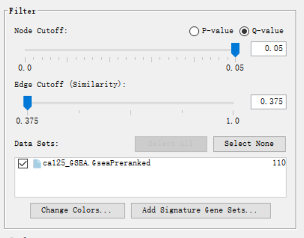
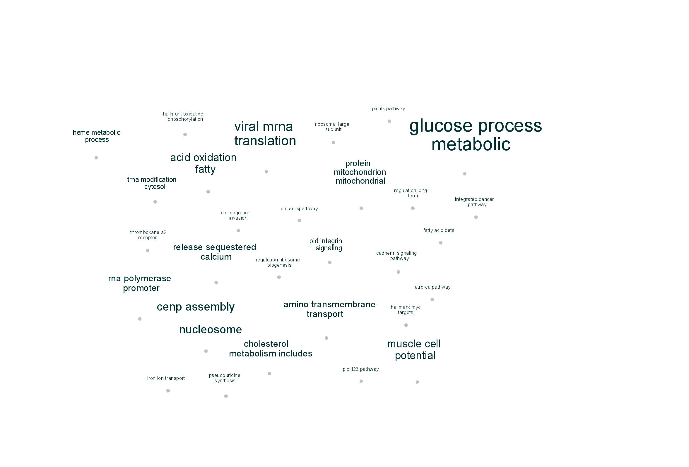

## Review from Assignemnt 1 and Assignemnt 2

In Assignemnt 1, I select a interested gene expression set GSE158317. This gene expression data records the data from treating ovarian cancer cell line with control miRNA or miR-330-3p. It also can be used for exploring immnue system activation with specific subtype of ovarian cancer and prove that plasma cell could be a important target for identifying mesenchymal ovarian cancer. [@assignment1] I
clean the dataset, map it to HUGO symbols and apply normalization to it; In Assignemnt 2, I build a model to the dataset according to the significant factor of the data, fit data into model and compute differential expression using empircal Bayes using BH hypothesis testing. Then we record the up-regulated and down-regulated gene names based on their differential expression value's adjusted P-value with threshold 0.05. The threshold filters out the unconvincing result and these gene names will be sent to g:profiler to conduct a over-representation analysis.

According to the orignal paper of the dataset GSE158317, the treatment of miR-330-3p to the experimental cell line will increase the expression level JAM2[@original], which is a genes encoded junctional adhesion proteins.[@assignment2] After performing a over-representation analysis, I find out that they are annotations related to junctional adhesion shown in the term list of the down-regulated ORA and many annotations related to transcription shown in the down-regulated ORA result. This proves the idea that miR-330-3p is a activator of JAM2. Also, they are many annotations related to neuro diseases shown in the down-regulated ORA result. This follows the idea from some studies that the increasing level of JAM is a trigger for many neuro diseases[@neuro].

## Preparation

Code reference: [Assignment 2](https://github.com/bcb420-2021/Zijin_He/blob/main/A2_ZijinHe.Rmd)[@assignment2]

### Install necessary pacakges:

```{r message = FALSE}

if (! requireNamespace("BiocManager", quietly = TRUE)) {
  install.packages("BiocManager")
}

if (! requireNamespace("RCurl", quietly = TRUE)) {
  install.packages("RCurl")
}

if (! requireNamespace("ggplot2", quietly = TRUE)) {
  install.packages("ggplot2")
}

if (! requireNamespace("RCy3", quietly = TRUE)) {
  BiocManager::install("RCy3")

}

if (! requireNamespace("GEOmetadb", quietly = TRUE)) {
  install.packages("GEOmetadb")
}

if (! requireNamespace("GEOquery", quietly = TRUE)) {
  install.packages("GEOquery")
}

if (! requireNamespace("edgeR", quietly = TRUE)) {
  install.packages("edgeR")
}

if (! requireNamespace("biomaRt", quietly = TRUE)) {
  install.packages("biomaRt")
}

library(GEOmetadb)
library(GEOquery)
library(edgeR)
library(biomaRt)
 

library(BiocManager)
library(RCurl)
library(ggplot2)
library(RCy3)

```

### Retrieve dataset from Assignment 2:

Read the dataset GSE158317:
```{r message = FALSE}
sfiles = getGEOSuppFiles('GSE158317')
fnames = rownames(sfiles)
read_exp = read.delim(fnames[3],header=TRUE,                check.names = FALSE)
```


Map esembl id to HUGO symbols:
```{r message = FALSE}
ensembl <- useMart("ensembl")
ensembl = useDataset("hsapiens_gene_ensembl",mart=ensembl)
conversion_stash <- "exp_conversion.rds"
if(file.exists(conversion_stash)){  
   exp_conversion <- readRDS(conversion_stash) 
   }else {  
   exp_conversion <- getBM(attributes = c("ensembl_gene_id","hgnc_symbol"),                            
                           filters = c("ensembl_gene_id"),                            
                           values = read_exp$ID,                            
                           mart = ensembl)  
                           saveRDS(exp_conversion, conversion_stash)
   }
counts_annot <- merge(exp_conversion,read_exp,by.x ='ensembl_gene_id',by.y='ID')
n_occur <- data.frame(table(counts_annot$ensembl_gene_id))
hgnc_occur <- data.frame(table(counts_annot$hgnc_symbol))
hgnc_occur <- hgnc_occur[hgnc_occur$Freq > 1,]
n_occur <- n_occur[n_occur$Freq > 1,]
dup_id_symbol <- counts_annot[counts_annot$ensembl_gene_id %in% n_occur$Var1,2]
for (ID in n_occur$Var1){
  counts_annot[counts_annot$ensembl_gene_id == ID,2]<- counts_annot[counts_annot$ensembl_gene_id == ID,2][1]
}
```

Remove low counts:
```{r message = FALSE}
cpms = cpm(counts_annot[,3:10])
rownames(cpms) <- counts_annot[,1]
keep = rowSums(cpms >1) >= 4
count_filtered = counts_annot[keep,]
```

Create sample table:
```{r message = FALSE}
samples <- data.frame(matrix(ncol = 2, nrow = 8))
rownames(samples) <- colnames(count_filtered)[3:10]
colnames(samples) <- c("Cell line","Treatment")

samples$`Cell line` <- c("COV318","COV318","COV318","OVCAR3","COV318","COV318","COV318","OVCAR3")
samples$Treatment <- c("Control","Control","Control","Control","miR-330-3p","miR-330-3p","miR-330-3p","miR-330-3p")
  
```


Create matrix for normalization:
```{r message = FALSE}
filtered_matrix <- as.matrix(count_filtered[,3:10])
rownames(filtered_matrix) <- count_filtered$ensembl_gene_id
d = DGEList(counts=filtered_matrix, group=samples$Treatment)
d = calcNormFactors(d)
normalized_counts <- cpm(d)
normalized_data<- as.data.frame(normalized_counts)
```

Add symbol column to normalized data and reorder it:
```{r message = FALSE}
normalized_data$HUGO_symbol <- count_filtered$hgnc_symbol
normalized_data <- normalized_data[,c(9,1,2,3,4,5,6,7,8)]
```

```{r message = FALSE}
model_design <- model.matrix( ~ samples$Treatment + samples$`Cell line`)
```

Create a matrix and fit data to model, then compute differential expression using empircal Bayes.
```{r}
expressionMatrix <- as.matrix(normalized_data[,2:9])
colnames(expressionMatrix) <- colnames(normalized_data)[2:9]
minimalSet <- ExpressionSet(assayData=expressionMatrix)
fit <- lmFit(minimalSet, model_design)
fit_pat <- eBayes(fit,trend=TRUE)
```

Choose BH method for mutiple hypothesis testing since I want to reduce more false positive results.
```{r message = FALSE}
topfit <- topTable(fit_pat,
                   coef=ncol(model_design),
                   adjust.method = "BH",                   
                   number = nrow(expressionMatrix))
```

Merge HUGO symbol to the dataframe and order the hits by p-value:
```{r message = FALSE}
output_hits <- merge(normalized_data[,1:2], topfit,by.y=0,by.x=0,all.y=TRUE)
output_hits <- output_hits[order(output_hits$P.Value),]
```

Remove unnecessary column, add row names and change column name:
```{r message = FALSE}
output_hits = subset(output_hits, select = -c(3) )
rownames(output_hits) <- output_hits[,1]
names(output_hits)[names(output_hits) == "Row.names"] <- "ensembl_id"
```

Now we retrieve the dataset output_hits, with differeital gene expression value. This will be used for non-threshold GSEA.

### Threshold ORA result 

The gene names from are written output_hits into tables and sent to g:profiler for threshold ORA. Here are the result pictures of threshold ORA:


<details>
  <summary>1. All genes</summary>

</details> 

<details>
  <summary>2. Up-regulated genes</summary>

</details> 

<details>
  <summary>3. Down-regulated genes</summary>

</details> 


## Non-thresholded Gene set Enrichment Analysis

In order to conduct a non-threshold GSEA, we need to prepare the ranked gene list and choose appropriate gene set database. I will prepare my expression set and gene set database with R code and use the application GSEA v4.1.0 for Windows to run GSEA.

Code reference: [Enrichment Map Analysis Pipeline](https://baderlab.github.io/Cytoscape_workflows/EnrichmentMapPipeline/Protocol2_createEM.html#28_Create_an_Enrichment_map)[@empipeline]

1. Generate a ranked set of genes from output_hits. The rank score will be calculated by signed fold change * -log10pvalue [@calculate_rank]. Clean up the data set and write into .rnk file.

```{r message = FALSE}
ranked_gene_list = data.frame(GeneName = output_hits$HUGO_symbol, rank = sign(output_hits$logFC) * -log10(output_hits$adj.P.Val))

# Remove the rows with empty string in the columns. This prevents the parse error when loading data to GSEA.
ranked_gene_list <- ranked_gene_list[which(ranked_gene_list$GeneName != ""),]

write.table(x=ranked_gene_list, file="ca125_ranked_list.rnk",sep = "\t", row.names = FALSE,col.names = TRUE,quote = FALSE)


```


2. I download EN gene sets from baderlab to the working directory. I choose this human gene sets since it is up-to-data and my data set contains experiment data related to human ovarian cell.

```{r  message=FALSE, warning=FALSE, include=FALSE}

# Data set url:
gmt_url = "http://download.baderlab.org/EM_Genesets/current_release/Human/symbol/"

#list all the files on the server
filenames = getURL(gmt_url)
tc = textConnection(filenames)
contents = readLines(tc)
close(tc)

#get the gmt that has all the pathways and does not include terms inferred from electronic annotations(IEA)
#start with gmt file that has pathways only
rx = gregexpr("(?<=<a href=\")(.*.GOBP_AllPathways_no_GO_iea.*.)(.gmt)(?=\">)",
  contents, perl = TRUE)
gmt_file = unlist(regmatches(contents, rx))

dest_gmt_file <- file.path(gmt_file)

download.file(
    paste(gmt_url,gmt_file,sep=""),
    destfile=dest_gmt_file
)

```


3. Open the software GSEA v4.1.0, Load the .gmt file downloaded from step 2 and ca125_ranked_list.rnk file from step 1. 


4. Set parameter to GSEAPreranked.
Select loaded .gmt file as Gene sets Database and ca125_ranked_list.rnk for Ranked List. I choose not collapse to gene symbols since the ranked list' gene names are HUGO symbols. Change max size exclude large sets to 200 and seed to permuation 12345. Change the output folder to be the getwd()+"/GSEAoutput". Click Run at the bottom of GSEA panel.


5. Open result of GSEA to R.(This GSEA result files have already uploaded to github.)

```{r message = FALSE}
# The output directory will be GSEAoutput under current woring directory.
output_dir <- paste(getwd(),"/GSEAoutput",sep="")

# Find the result .tsv file
gsea_result <- list.files(path = file.path(output_dir), pattern = "gsea_report.*\\.tsv$")
gsea_result
```

gsea_result has 2 tsv file names, the positive one is the up-regulated gene set and the negative one is for down-regulated gene set.

```{r message = FALSE}
gsea_downregulated_result <- read.delim(file.path(output_dir, gsea_result[1]), stringsAsFactors = F)

gsea_upregulated_result <- read.delim(file.path(output_dir, gsea_result[2]), stringsAsFactors = F)

```

Order the result by normalized expression score. Visualize the up-regulated and down-regulated pathway result:
```{r message = FALSE}
gsea_upregulated_result <- gsea_upregulated_result[order(-gsea_upregulated_result$NES),]

gsea_downregulated_result <- gsea_downregulated_result[order(gsea_downregulated_result$NES),]

gsea_upregulated_result[1:10,c(1,6,8,9,10,11)]
gsea_downregulated_result[1:10,c(1,6,8,9,10,11)]
```

### GSEA Result summery
According to the up-regulated result tables, the top hits with high expression score are all related metabolic process like nucleotide phosphorylation and glycolytic process. In down-regulated result tables, most of the top hits annotations are related to membrane potential cycles, like calcium ion transporter regulation and action potential. Other noticeable annotations in down-regulated results include cholesterol metabolic and synthetic process and some integrin pathways.

### Threshold ORA vs Non-threshold GSEA

For up-regulated gene set, the top term of annotations from threshold ORA and non-threshold GSEA are not exactly same, which makes it hard to make a straight forward comparison. However they share a similar pathway tendency. Both of the results have enriched types of metabolic process. Many RNA processing annotations are shown at top of threshold ORA GO:BP list and they also have a high ES in non-threshold GSEA table.

For down-regulated gene set, results from threshold ORA vs non-threshold GSEA are more different and they required a cross-over data source result comparison. In threshold ORA GO:BP list, most of top annotations are related to cellular component and localization, while in non-threshold GSEA result, the top hits are related to membrane potential cycles. However in the threshold ORA REAC list, membrane trafficking is a top hit.

In Assignment 2 we identify that pathway related to cell adhesion should be over expressed in the data set and in threshold ORA result we do have many adhesion related annotations. In fact, several pathways related to adhesion receptor have already shown up in the top of non-threshold GSEA result, like "	
PID_INTEGRIN_A4B1_PATHWAY" and "CADHERIN SIGNALING PATHWAY". Let's try to manually search key words in the non-threshold GSEA:

```{r message = FALSE}
gsea_downregulated_result[grep("ADHESION",gsea_downregulated_result$NAME),1]
```

There are 35 adhesion-related annotations in non-threshold GSEA table, which follows the pattern in threshold ORA result.


## Visualize GSEA result in Cytoscape.

### Load data

I use Cytoscape 3.8.2 for Windows for analyzing GSEA. EnrichmentMap, GeneMania and AutoAnnotate apps are installed within the Cytoscape.

1. Open Cytoscape, click App > EnrichmentMap.
2. Click Scan a folder for Enrichment Map.
3. Load the file:

Enrichment pos > gsea_report_for_na_pos_1617822744025.tsv
Enrichment neg > gsea_report_for_na_neg_1617822744025.tsv
gmt > Human_GOBP_AllPathways_no_GO_iea_March_01_2021_symbol.gmt
ranks > ranked_gene_list_na_pos_versus_na_neg_1617822744025.tsv
expressions > ca125_ranked_list.rnk

4. Set FDR q-value cutoff to 0.01 so the genes in gene set definition file but not in expression file will be filtered out. [@em_threshold]
5. Other paramters remains default.
6. Click Build to build the network.


### Create the map

After clicking Build, the initial map will be shown in the window. There are 110 nodes and 493 edges.


The threshold value that I used for the Enrichment Map:


### Add annotation

I use AutoAnnotate app for annotation of the map.
1. Select > Select all nodes and edges
2. Apps > AutoAnnotate > New Annotate Set
3. Click check box for Layout network to prevent overlap.
4. Other parameters remains default.


### Publication-Ready Image

1. Checking the box for publication ready figure in Enrichment Map
2. Adjust the layout and style in AutoAnnotate panel.


### Collapse the network to a theme network

In the AutoAnnotate panel, select Collapse All to collapse node to a theme network.




The major themes presented in the GSEA include glucose metabolic process, muscle cell potential, RNA polymerase promoter, amino acid transmembrane transport, nucleosome, etc. The theme RNA polymerase promoter could be explained in the model since the treatment miRNA miR-330-3p is a activator for JAM gene transcription. Other themes do not have explicit association with the expression model, which can be considered as novel over-expressed pathways. 

## Interpretation

According to the network of GSEA, we find out that they are many over-expressed themes that cannot be explained by the model. The common feature of these novel pathways is that they are very general and could be included in many different biological process like glucose metabolism. Therefore we cannot infer the specific role of the these pathways in the model. 
We also some pathways related to junctional adhesion, like integrin signalling pathways and cadherin signalling pathways. This supports the idea in the original paper that inducing miR-330-3p could increase the junctional adhesion in ovarian cells. Some publications also show that the ovarian cell lines has explicit preference for integrin-mediated adhesion, which also explains the appearance of integrin signalling pathways in GSEA network. [@integrin]


## Post-analysis: Theme analysis

The theme that I choose for post-analysis is pid intergin signalling. It has two node pathways and I will generate a gene network for this theme using GeneMania.


Select the theme and in option menu click Show in GeneMania.


For the genes shown in the gene network, display their p-values and logFC from original dataset:

```{r message = FALSE}
# Read txt file with genes names shown in network
anno <- read.table("gene_names.txt")

# Create a dataframe with gene names in txt file and their p-value and logFC
anno_gene <- data.frame(gene = anno$V1, logFC = output_hits$logFC[which(output_hits$HUGO_symbol %in% anno$V1)], p_value = output_hits$adj.P.Val[which(output_hits$HUGO_symbol %in% anno$V1)])

# View the table with the ordered logFC value.
anno_gene[order(anno_gene$logFC),]
```

The genes with large logFC include PRKAR1B, JAM2, PTPRA for down-regulated and CD81,TLN1,PXN for up-regulated. In this theme we can see that the gene PRKAR1B has a extremely high expression that differs from other gene. According to the [GeneCards for RKAR1B ](https://www.genecards.org/cgi-bin/carddisp.pl?gene=PRKAR1B&keywords=PRKAR1B), this is a regulatory subunit of protein kinase, which is involved in cAMP signalling pathway. It is also involved in the ERK signalling pathway, which is also a pathway regulating cell proliferation and related to cancer development. [@ERK] In fact, some studies indicate that there is a over expresion for non-coding RNA PRKAR1B-AS2 in ovarian cancer cells [@PRKAR1B]. Although the original paper of my gene set is focused on the over expreesion of JAM2 when inducing miR-330-3p to ovarian cells, PRKAR1B could also be used as a novel target gene to trace back the pathway how miR-330-3p shapes the mesenchymal ovarian cancer cells.


## Reference

  Martin Morgan (2019). BiocManager: Access the Bioconductor Project Package Repository. R package     version 1.30.10. https://CRAN.R-project.org/package=BiocManager
  
  Davis, S. and Meltzer, P. S. GEOquery: a bridge between the Gene Expression Omnibus (GEO)
  
  H. Wickham. ggplot2: Elegant Graphics for Data Analysis. Springer-Verlag New York, 2016.
  and BioConductor. Bioinformatics, 2007, 14, 1846-1847
  
  Gustavsen JA, Pai S, Isserlin R et al. RCy3: Network biology using Cytoscape from within R [version 3; peer review: 3 approved].F1000Research 2019, 8:1774 https://doi.org/10.12688/f1000research.20887.3
  
  Gene set enrichment analysis: A knowledge-based approach for interpreting genome-wide expression profiles
Aravind Subramanian, Pablo Tamayo, Vamsi K. Mootha, Sayan Mukherjee, Benjamin L. Ebert, Michael A. Gillette, Amanda Paulovich, Scott L. Pomeroy, Todd R. Golub, Eric S. Lander, Jill P. Mesirov
Proceedings of the National Academy of Sciences Oct 2005, 102 (43) 15545-15550; DOI: 10.1073/pnas.0506580102
  

  BCB420 Slides Lecture 3 - Finding Expression DataLecture by Ruth Isserlin2021-01-24
  
  BCB420 Slides Lecture 4 -Exploring the data and basics of Normalization by Ruth Isserlin 2021-1-31
  
  BCB420 Slides Lecture 5 - Data exploration and Identifier mapping by Ruth Isserlin 2021-02-07
  
  BCB420 Slides Lecture 6 - Differential gene expression analysis by Ruth Isserlin 2021
  
  BCB420 Slides Lecture 7 - Annotation Resources and Simple Enrichment by Ruth Isserlin 2021
  
  BCB420 Slides Lecture 11 -  - Enrichment Map andother Cytoscape Appsother Cytoscape Apps by Ruth Isserlin 2021
  
  BCB420 Slides Lecture 12 -  Enrichment Map andother Cytoscape Appsother Cytoscape Apps by Ruth Isserlin 2021
  
  Shannon P, Markiel A, Ozier O, Baliga NS, Wang JT, Ramage D, Amin N, Schwikowski B, Ideker T. Cytoscape: a software environment for integrated models of biomolecular interaction networks Genome Research 2003 Nov; 13(11):2498-504
  
  Cytoscape 3.8.2 User Manual http://manual.cytoscape.org/en/stable/index.html
  
  
